## UNIVERSIDAD DEL ZULIA
FACULTAD EXPERIMENTAL DE CIENCIAS  
DIVISIÓN DE PROGRAMAS ESPECIALES  
LICENCIATURA EN COMPUTACIÓN

# Sistema Financiero

**PROYECTO FINAL**  
Presentado por: **Hernández, Edelyn**  
CI: 28109107  

PERIODO II - 2026

---

## AGENDA

1. Identificar: entradas, procesos y salidas
2. Ciclo de Vida seleccionado (resumen)
3. Tecnologías y Herramientas de Desarrollo
4. Diagrama de Flujo de Datos (DFD)
5. Diccionario de Datos (DFD)
6. Diagrama Entidad – Relación
7. Diccionario de Datos (Diagrama E-R)
8. Interfaces de Entrada / Salida
9. Demostración de Pruebas al SI
10. Plan de Mantenimiento
11. Personal que participó (soporte - minuta)

---

## ENTRADA – PROCESOS - SALIDAS

### ENTRADAS
- Ingresar producto (nombre, categoría, precio, stock mínimo)
- Ingresar cantidades (stock inicial, movimientos)
- Ingresar precio (VES o USD)
- Ingresar tipos de pago (efectivo BS/USD, pago móvil, tarjeta, bio-pago)
- Registrar usuarios (credenciales)
- Fecha de compra/venta
- Cambios del día (tasa BCV automática)
- Movimientos de inventario (compras, ajustes, mermas, devoluciones)

### SALIDAS
- Comprobante de venta: productos, precio BCV, tipo de pago, tasa aplicada, fecha/hora
- Factura detallada con formato FAC-YYYYMMDD-NNN
- Inventarios actualizados por producto
- Reportes diarios consolidados (ventas, movimientos, tasas)
- Reporte exportable a Excel
- Dashboard: ventas hoy, stock bajo, sin stock, tasa BCV
- Tabla de productos con alerta de stock bajo
- Historial completo de ventas
- Alertas visuales de stock bajo / sin stock

### PROCESOS
- Validar existencia del producto e inventario suficiente
- Convertir precio USD a bolívares (tasa BCV)
- Calcular total de venta (subtotales + total)
- Registrar tipo de pago (5 métodos, pagos mixtos VES/USD)
- Registrar tasa BCV aplicada en la venta
- Actualizar inventario con auditoría de movimientos
- Generar factura (FAC-YYYYMMDD-NNN)
- Autenticar usuarios con bcrypt
- CRUD completo de productos (crear, editar, eliminar)
- Control de inventario (compra, venta, merma, ajuste, devolución)
- Generar reporte diario consolidado
- Exportar reporte a Excel

---

## CICLO DE VIDA SELECCIONADO

**Metodología:** Ciclo de Vida de Llorens Fábregas (II) — Modelo Cascada/Secuencial.

- Estructura predecible para proyectos de mediana complejidad con requisitos predefinidos.

**Problema Actual en el Abasto:**
- Inexistencia de un control de inventario sistemático
- Pérdida de tiempo en cálculos manuales de conversión VES/USD
- Dificultad para auditar y controlar el total de las ventas diarias

**Ventajas:**
- Gestión ordenada por fases secuenciales y requisitos estables
- Énfasis en diseño de BD para evitar fallas a largo plazo
- Feedback tardío del cliente (mitigado con plan de pruebas previo al despliegue)

### Fases Aplicadas

| Fase | Descripción |
|------|-------------|
| **1. Requisitos** | Definición de necesidades: registro diario de ventas, alertas de stock bajo, cálculo bimonetario con tasa del día, actualización de inventario |
| **2. Análisis y Diseño** | Migración de procesos manuales a menú interactivo (CRUD, facturación, tasa, reporte diario) |
| **3. Construcción** | Esquema relacional SQLite + interfaces PyQt6 |
| **4. Pruebas y Mantenimiento** | Verificación de conversión de monedas, registro contable, monitoreo continuo |

---

## TECNOLOGÍAS Y HERRAMIENTAS DE DESARROLLO

| Categoría | Tecnología |
|-----------|------------|
| **Lenguaje** | Python ≥3.14 — tipado estático, alta legibilidad |
| **Frontend/Backend** | PyQt6 (≥6.11) — interfaz gráfica de escritorio industrial |
| **Base de Datos** | SQLite + SQLModel (≥0.0.38) — ORM híbrido Pydantic/SQLAlchemy |
| **Tasas BCV** | scraper-bcv — consulta en tiempo real |
| **Seguridad** | bcrypt — hasheo de contraseñas |
| **Reportes** | openpyxl — generación de Excel |
| **Gráficos** | pyqtgraph — renderizado de ventas semanales |
| **Calidad** | pytest / pytest-qt, Ruff (linter), Mypy (tipos) |

---

## DIAGRAMA DE FLUJO DE DATOS - DFD: Nivel 0 (Contexto)

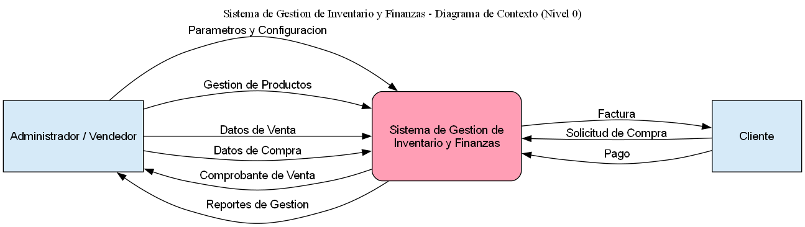

---

## DIAGRAMA DE FLUJO DE DATOS - DFD: Nivel 1

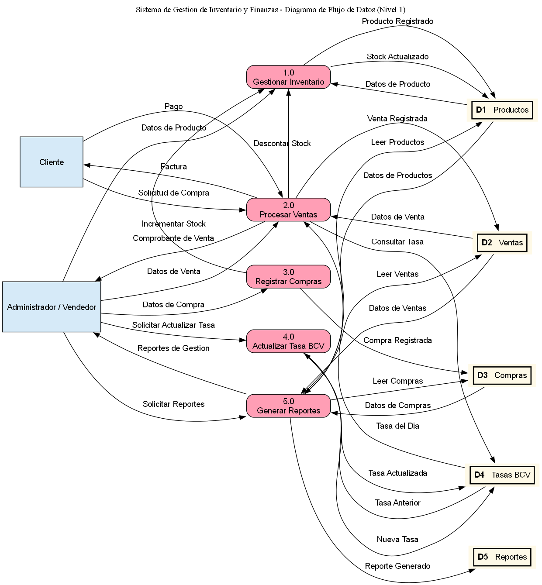

---

## DIAGRAMA DE FLUJO DE DATOS - DFD: Nivel 2

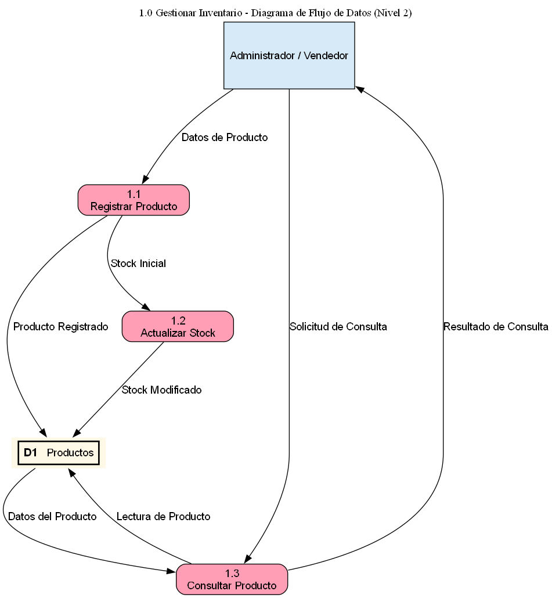

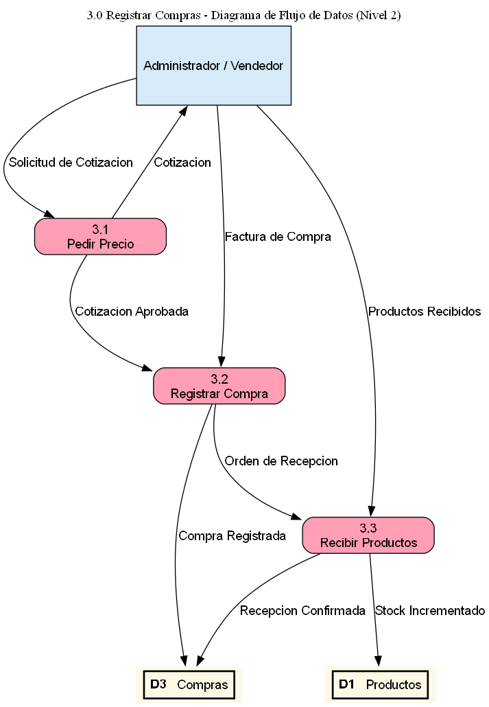

---

## DIAGRAMA DE FLUJO DE DATOS - DFD: Nivel 2 (Procesar Ventas)

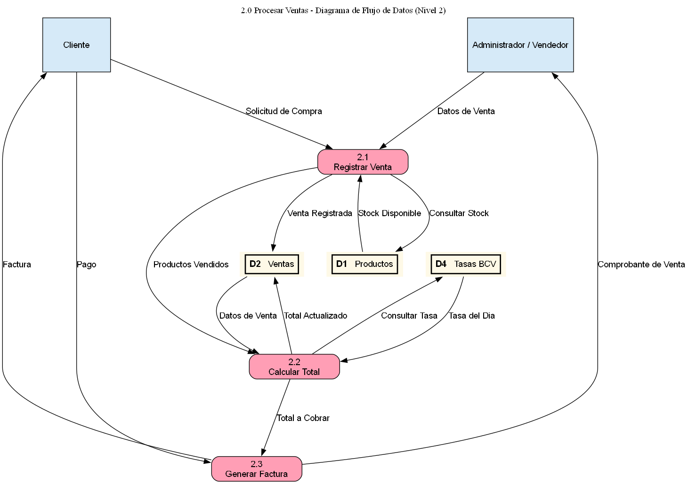

---

## DIAGRAMA DE FLUJO DE DATOS - DFD: Nivel 2 (Generar Reportes)

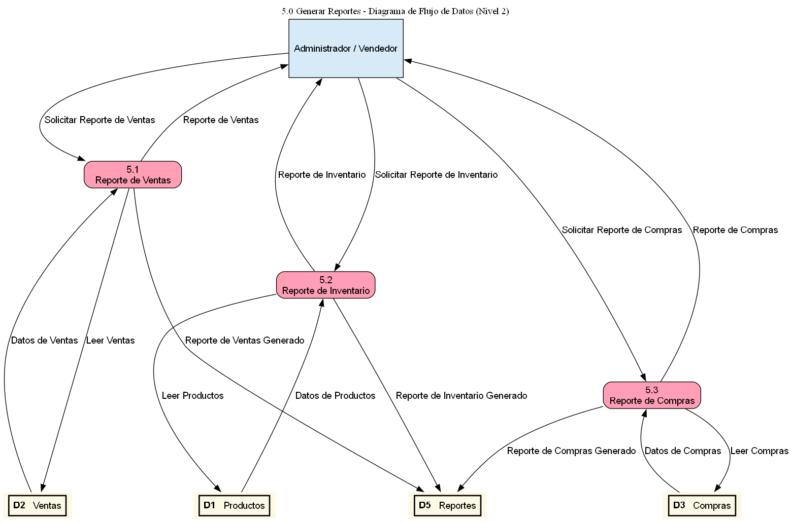

---

## DIAGRAMA DE FLUJO DE DATOS - DFD: Nivel 2/3

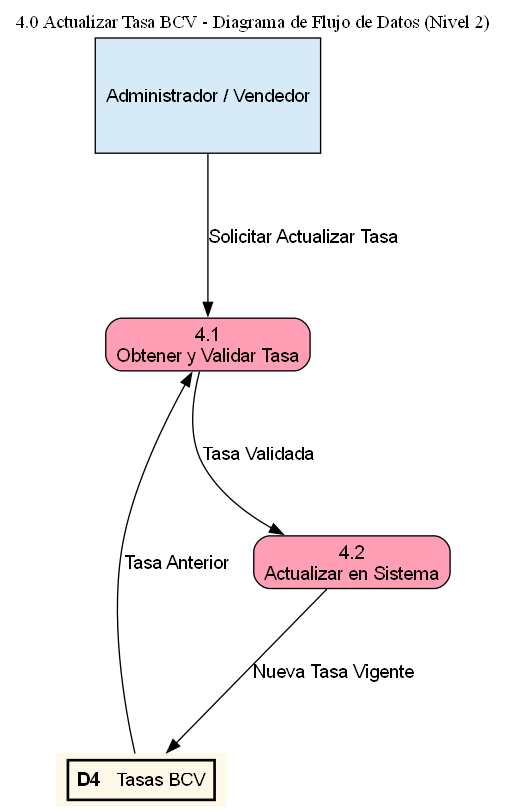

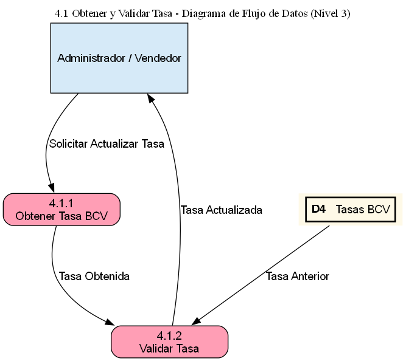

---

## DIAGRAMA DE FLUJO DE DATOS - DFD: Nivel 3 (Registrar Venta)

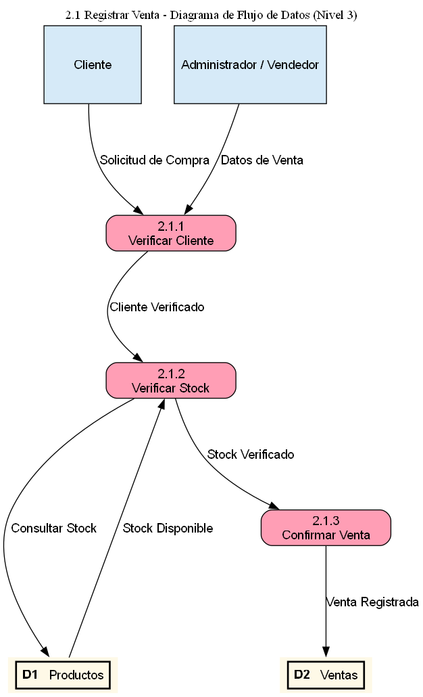

---

## DICCIONARIO DE DATOS - DFD

### Almacenes de Datos
| Almacén | Descripción |
|---------|-------------|
| **D1: Usuario** | Credenciales hasheadas con bcrypt para login |
| **D2: Producto/MovimientoInventario** | Catálogo de productos y bitácora de stock |
| **D3: Venta/VentaDetalle** | Histórico de facturas desglosadas por método de pago |
| **D4: TasaCambio** | Registro diario de tasas BCV indexadas por fecha |
| **D5: ReporteDiario** | Cierres de caja persistidos con totales y alertas |

### Flujos de Datos Principales
- **Credenciales:** usuario + contraseña (hasheada en Core)
- **Producto:** nombre + precios VES/USD + stock
- **Venta:** número_factura + detalles + desglose de pagos
- **Auditoría de Stock:** cantidad + stock_anterior/nuevo + tipo de movimiento

---

## PLANTILLAS DEL DICCIONARIO DE DATOS - DFD

### Ficha de Proceso

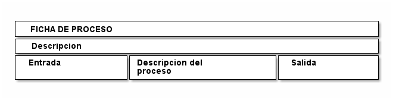

---

## PLANTILLAS DEL DICCIONARIO DE DATOS - DFD

### Ficha de Flujo de Dato

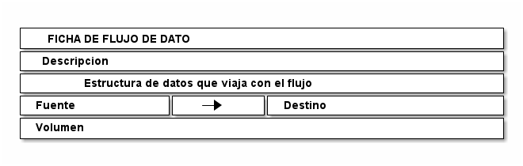

---

## PLANTILLAS DEL DICCIONARIO DE DATOS - DFD

### Ficha de Almacén

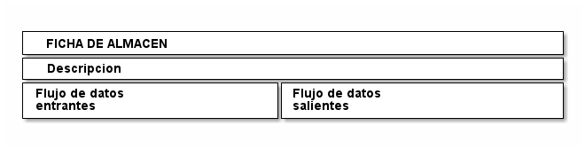

---

## PLANTILLAS DEL DICCIONARIO DE DATOS - DFD

### Ficha de Entidad

---

## DIAGRAMA ENTIDAD – RELACIÓN

### Diseño de Base de Datos Relacional

- **Integridad:** SQLite con 7 tablas interconectadas, llaves primarias y foráneas explícitas
- **Ventas ↔ Productos (N:M):** Tabla intermedia **VentaDetalle** almacena cantidad e importe unitario por ítem
- **Auditoría de Inventarios (1:N):** Tabla **MovimientoInventario** enlazada a Producto para trazabilidad completa

---

## DICCIONARIO DE DATOS (E-R)

### Tabla `Producto`
`idproducto (PK)` | `nombre_producto` | `categoria` | `precio_compra` | `precio_venta_bs` / `precio_venta_usd` | `stock_actual` | `stock_minimo` | `unidad`

### Tabla `Venta`
`idventa (PK)` | `numero_factura (único)` | `fecha_venta` | `total_bs` / `total_usd` | `tasa_cambio` | Desglose de pagos: `efectivo_bs`, `efectivo_usd`, `tarjeta`, `pago_movil`, `bio_pago` | `estado` (COMPLETADA/ANULADA)

### Tabla `VentaDetalle` (Intermedia)
`id (PK)` | `venta_id (FK)` | `producto_id (FK)` | `cantidad` | `precio_unitario_bs` | `subtotal_bs`

### Tabla `MovimientoInventario` (Auditoría)
`id (PK)` | `producto_id (FK)` | `tipo` (ENTRADA/SALIDA/AJUSTE) | `motivo` | `cantidad` | `stock_anterior` / `stock_nuevo` | `referencia_id` | `observaciones` | `fecha_movimiento`

---

## INTERFACES DE ENTRADA / SALIDA

### Interfaces de Entrada
- **Ventana de Login:** Captura credenciales, restringe accesos con bcrypt
- **Formulario Producto:** Ingreso y edición de códigos, nombres, categorías, precios bimonetarios y stock
- **Registrar Venta / POS:** Panel interactivo para escanear productos, introducir tasa BCV y desglosar pagos

### Interfaces de Salida
- **Dashboard:** Resumen ejecutivo con totales VES/USD, indicador de tasa BCV, gráfico de ventas semanales (pyqtgraph)
- **Alertas de Stock Bajo:** Panel de inventario resalta en color de advertencia productos con stock mínimo
- **Reporte de Cierre Diario en Excel:** Hoja de cálculo formateada con resúmenes por método de pago

---

## PRUEBAS DE SISTEMAS DE INFORMACIÓN

- **Pruebas Funcionales (POS e Inventario):** Verificación de registro de ventas en bolívares y dólares, cálculo exacto de cambio, decremento inmediato de stock
- **Pruebas No Funcionales:** Hasheo bcrypt en contraseñas, tiempos de respuesta <100ms en UI
- **Pruebas Unitarias y de UI Automatizadas (pytest):**
  - **Total:** 172 tests unitarios ejecutados en CI
  - **UI (pytest-qt):** 36 pruebas automatizadas que simulan acciones del cajero

---

## PLAN DE MANTENIMIENTO

| Tipo | Descripción |
|------|-------------|
| **Correctivo** | Bitácoras de logs automáticos en `logs/` para reparaciones inmediatas |
| **Adaptativo** | Alembic para migraciones de esquema SQLite sin perder datos |
| **Perfectivo** | Planificación de impresión en ticketeras 80mm y cuentas por pagar |
| **Preventivo** | Copias de seguridad diarias de `database/database.db` a unidad externa o nube |

---

## CONCLUSIONES

### Conclusiones
- **Solución Bimonetaria:** Consulta automática de tasa BCV para cobro multimoneda
- **Auditoría Rigurosa:** Bitácora de movimientos reduce pérdidas de stock por merma
- **Calidad Certificada:** 172 pruebas garantizan robustez contable

### Recomendaciones
- **Impresión de Facturas Física:** Soporte de ticketeras 80mm para recibos en POS
- **Módulo de Cuentas por Pagar:** Control de deudas y compras a crédito
- **Centralización Sincronizada:** Migrar a PostgreSQL en la nube para múltiples tiendas
